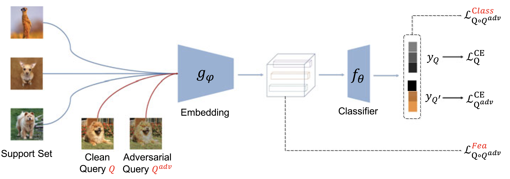

## Defensive Few-Shot Learning
This is a PyTorch implementation of the [DFSL](https://ieeexplore.ieee.org/document/9916072) paper.



### Dependencies

If you don't have python 3 environment:
```
conda create -n DFSL python=3.8
conda activate DFSL
```
Then install the required packages:
```
pip install -r requirements.txt
```

### Train & Test

1. We make the training and testing in a single script file.
2. Training Baseline with adversarial training and using DN4 for test:
    ```shell
      Python Baseline_AT_Test_DN4.py
    ```
3. Training DFSL and using DN4 for both training and test (A FGSM attacker is used.):
    ```shell
      Python DFSL_DN4_FGSM.py
    ```
4. Training DFSL and using DN4 for both training and test (A PGD attacker is used.):
    ```shell
      Python DFSL_DN4_PGD.py
    ```

### Citation

```
@ARTICLE{9916072,
  author={Li, Wenbin and Wang, Lei and Zhang, Xingxing and Qi, Lei and Huo, Jing and Gao, Yang and Luo, Jiebo},
  journal={IEEE Transactions on Pattern Analysis and Machine Intelligence}, 
  title={Defensive Few-Shot Learning}, 
  year={2023},
  volume={45},
  number={5},
  pages={5649-5667},
  doi={10.1109/TPAMI.2022.3213755}}
```
